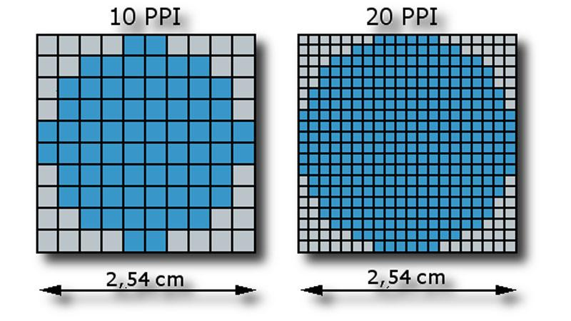

# 고해상도 기기의 렌더링 방식: Device Pixel Ratio

해상도는 화면이 몇 개의 픽셀로 이루어졌는지를 나타내는 값이다. 주로 `가로 픽셀 수  * 세로 픽셀 수`로 표현된다.

그리고 화면의 픽셀들이 좁은 공간에 얼마나 밀집되어 있는지를 나타내는 지표가 PPI이다. 같은 공간에 더 많은 픽셀이 밀집되어 있을 수록 더 정교한 표현이 가능하다.

아래가 아주 간단한 예시이다. 더 많은 픽셀이 밀집된 오른쪽이 원을 더 정교하게 표현한다.

현대의 디바이스 대부분은 PPI가 높은 고해상도 디스플레이를 가지고 있는데, 특히 모바일 디바이스도 마찬가지이다.

그런데 이때, 모바일 디바이스는 사실상 데스크탑과 동일한 수준의 높은 해상도를 가지지만, 우리는 모바일 기기에서 데스크탑 UI를 보는 것이 아닌, 작은 모바일 UI를 본다. 어떻게 그럴 수 있을까?

이는 바로 브라우저가 디바이스의 물리적 픽셀 여러개를 묶어서 CSS 1픽셀로 표현하기 때문인데, 그것을 Device Pixel Ratio, 줄여서 DPR이라고 부른다.

예를 들어, 아이폰 12는 가로 1170, 세로 2532의 해상도를 가지지만, 브라우저에서는 3의 DPR을 갖고 가로 390, 세로 844로 표현된다. (즉, 아이폰 12의 물리적 픽셀 3개를 CSS 1픽셀로 여기는 것)

따라서 브라우저에서 가로 390 픽셀이라고 해서 이미지, 동영상도 가로 390 픽셀로 준비하면 안되고, DPR에 따라 적절한 크기의 리소스가 다운로드 될 수 있도록 준비해야 한다.
