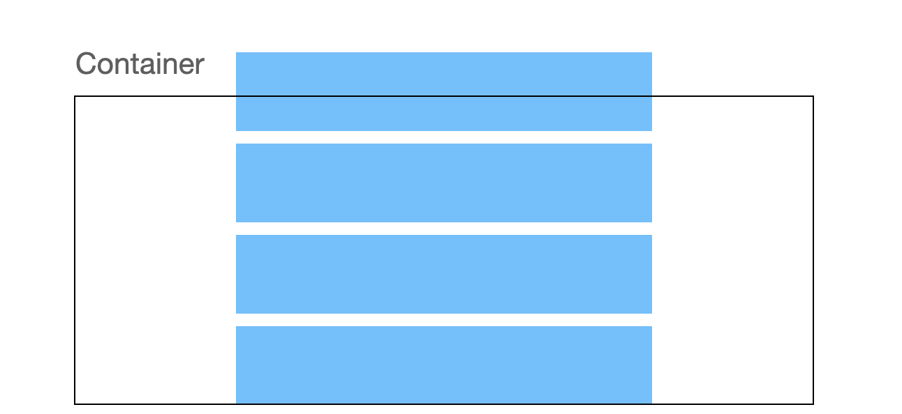
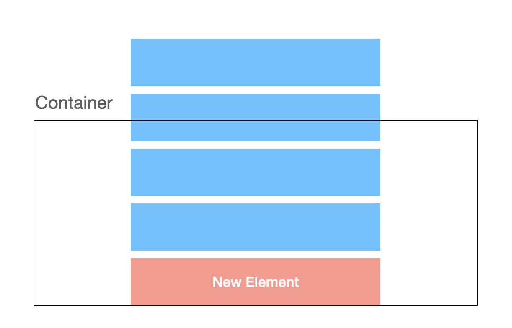
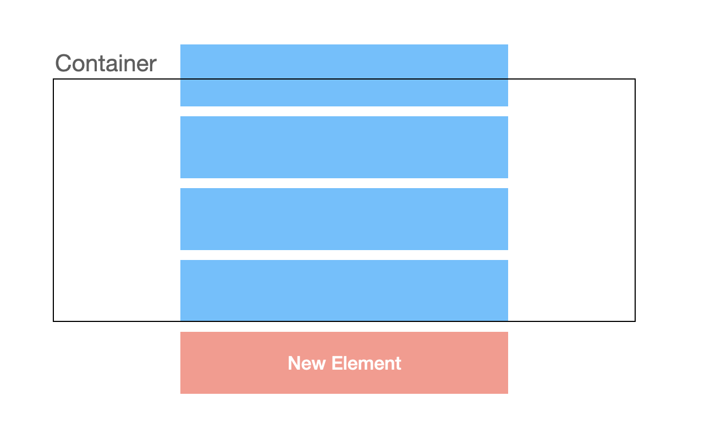

# Safari에서 flex-direction: column-reverse를 사용할 경우 생기는 스크롤, 렌더링 이슈

Safari에서 `flex-direction: column-reverse`를 사용하면 스크롤과 렌더링에 큰 문제가 생겼다.

`flex-direction: column-reverse` + `overflow-y: scroll`로 설정된 아래와 같은 리스트가 있다고 가정해보자.



이때 맨 위에 엘리먼트를 추가할 경우, 아래와 같이 추가되는게 정상이다.



다만 사파리는 아래와 같이 엘리먼트가 추가되는 이상한 동작을 했고, 심지어 scrollTop 값도 0에서 바뀌지 않는 버그도 있었다.



또한 엘리먼트를 1초 간격으로 지속해서 추가하다 보면, 기존에 렌더링된 엘리먼트들이 화면상에서 사라지는 렌더링 버그도 있었다.

이때 `flex-direction: column-reverse` + `overflow: hidden` 상태일 경우 위에 언급한 스크롤, 렌더링 버그가 생기지 않는다는 것을 발견했다.

따라서 `touchstart` 이벤트가 발생할 경우 `overflow: scroll`로 바꾸고, `touchend` 이벤트가 발생할 경우 다시 `overflow: hidden`으로 바꾸는 트릭을 시도했었다.

Chrome에서는 잘 동작했던 반면, 이 또한 Safari에서는 `touchstart` 핸들러에서 `overflow: scroll`로 설정하더라도 스크롤이 먹히지 않았다.

결국 `touchmove` 핸들러까지 추가해 스크롤 위치를 직접 바꿔주니 문제를 완전히 피해갈 수 있게 되었다.

아래는 해당 로직이 담긴 `useEffect` 콜백이다.

```typescript
useEffect(() => {
  const list = listRef.current;
  if (list == null) {
    return;
  }

  let startScrollTop: number | null = null;
  let startClientY: number | null = null;

  const handleTouchStart = (e: TouchEvent) => {
    const scrollTop = list.scrollTop;
    const clientY = e.changedTouches[0].clientY;
    startScrollTop = scrollTop;
    startClientY = clientY;

    requestAnimationFrame(() => {
      list.style.overflowY = "scroll";
    });
  };

  const handleTouchMove = (e: TouchEvent) => {
    if (startScrollTop == null || startClientY == null) {
      return;
    }

    const clientY = e.changedTouches[0].clientY;
    const nextTop = startScrollTop + (startClientY - clientY);

    requestAnimationFrame(() => {
      list.scrollTo({ top: nextTop });
    });
  };

  const handleTouchEnd = () => {
    startClientY = null;
    startScrollTop = null;

    requestAnimationFrame(() => {
      list.style.overflowY = "hidden";
    });
  };

  list.addEventListener("touchstart", handleTouchStart);
  list.addEventListener("touchmove", handleTouchMove);
  list.addEventListener("touchend", handleTouchEnd);

  return () => {
    list.removeEventListener("touchstart", handleTouchStart);
    list.addEventListener("touchmove", handleTouchMove);
    list.removeEventListener("touchend", handleTouchEnd);
  };
}, []);
```
