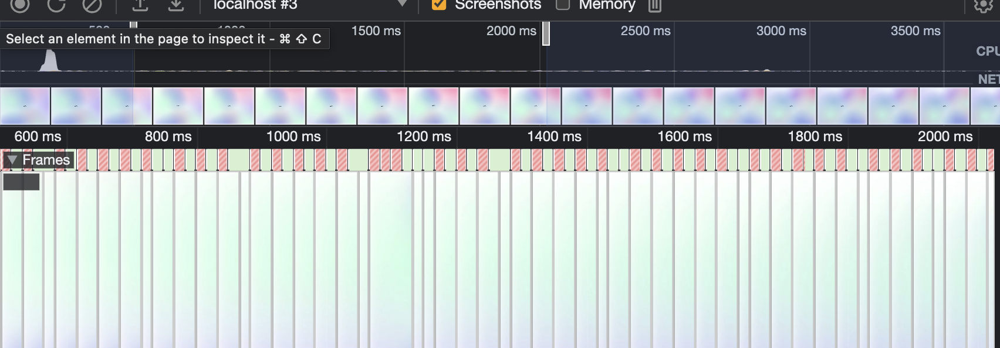
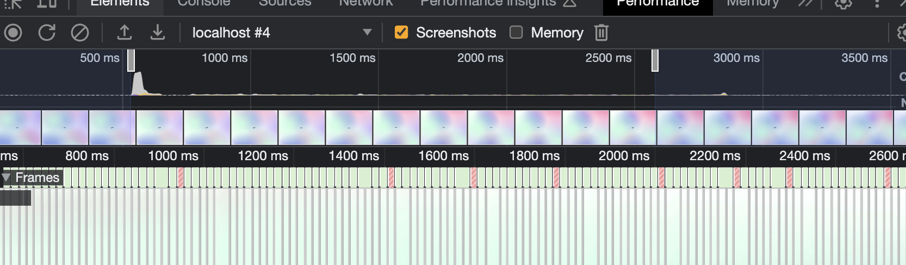
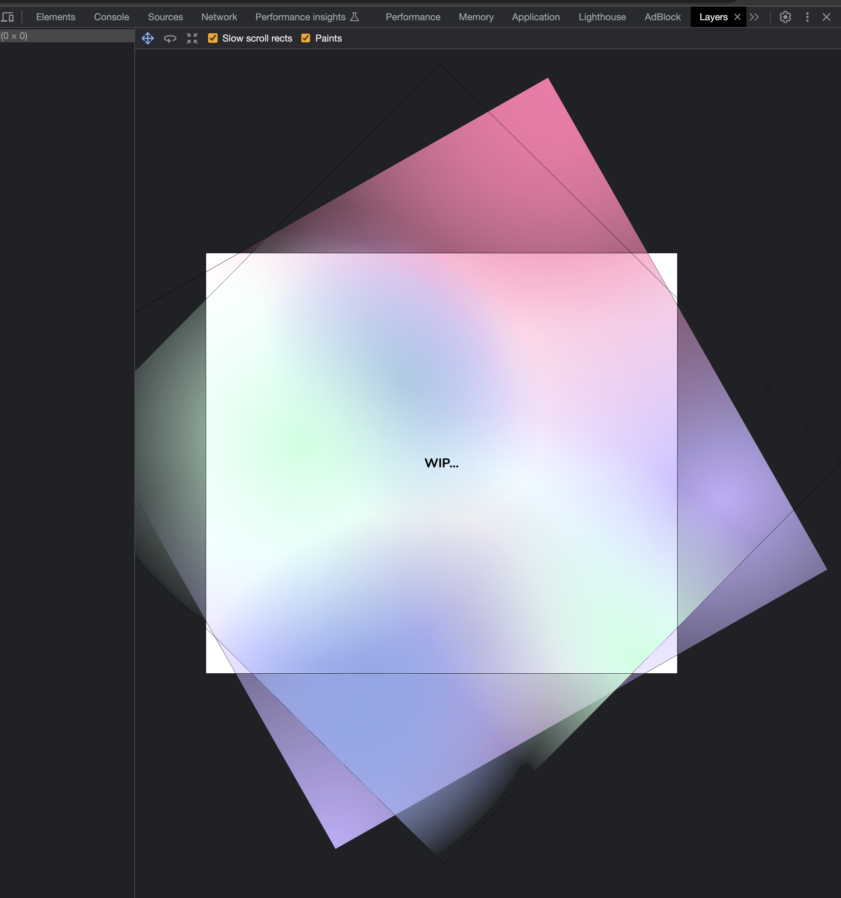
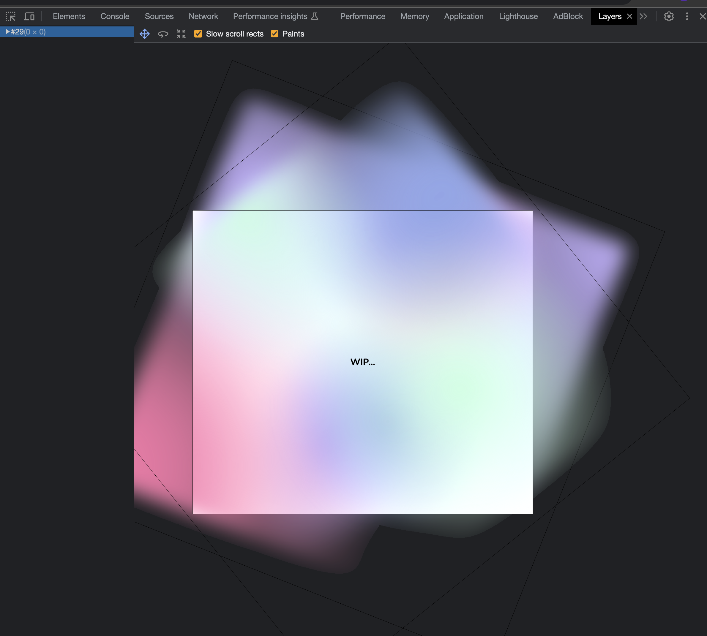

# transform: rotate() + filter: blur() 퍼포먼스 개선 (feat. 레이어, 합성)

아래와 같이 하위 엘리먼트에 무한 rotate 애니메이션을 적용해둔 후, 부모 엘리먼트에 blur를 적용하는 방식으로 하면, 엄청나게 심한 프레임 드랍이 생긴다.

```jsx
<div
  css={css`
    filter: blur(50px);
  `}
>
  <div
    css={css`
      @keyframes rotate {
        0% {
          transform: rotate(0deg);
        }
        100% {
          transform: rotate(360deg);
        }
      }

      animation: rotate 15s linear infinite;
    `}
  />
</div>
```



이때, 하위 엘리먼트 자체에 blur를 걸어주는 경우, 프레임 드랍의 대부분이 사라진다.

```jsx
<div>
  <div
    css={css`
      @keyframes rotate {
        0% {
          transform: rotate(0deg);
        }
        100% {
          transform: rotate(360deg);
        }
      }

      animation: rotate 15s linear infinite;

      filter: blur(50px);
    `}
  />
</div>
```



왜 이렇게 한다고 개선이 되는 것인지 생각해봤는데, 브라우저의 렌더링 과정 중 레이어 + 합성과 연관지어 추측해보니 쉽게 결론이 났다.

- 이미 blur 처리된 레이어를 rotate만 하기
- 하위 레이어를 rotate하고 blur가 적용된 상위 레이어와 합성하기

위 두 가지 중 하나를 매 프레임마다 진행한다고 했을 때 전자는 최초에 렌더링이 끝난 레이어를 rotate만 해주면 되지만, 후자는 매 렌더링마다 합성 과정에서 blur가 새롭게 적용되어야 할 것이다. CSS filter 속성이 비싼 작업임을 고려하면, 당연히 전자가 더 저렴한 작업일 것이다.

여담으로 Chrome devTools에는 Layers라는 기능이 숨겨져 있는데, 그걸로 실제로 레이어가 어떻게 생성되어 서로 합성되고 있는지 시각화할 수 있다.

첫 번째가 개선 전, 두 번째가 개선 후 캡쳐본인데, 위에서 레이어 + 합성과 연관지어 추측한 내용과 결론이 정확했다는 것을 알 수 있다.




