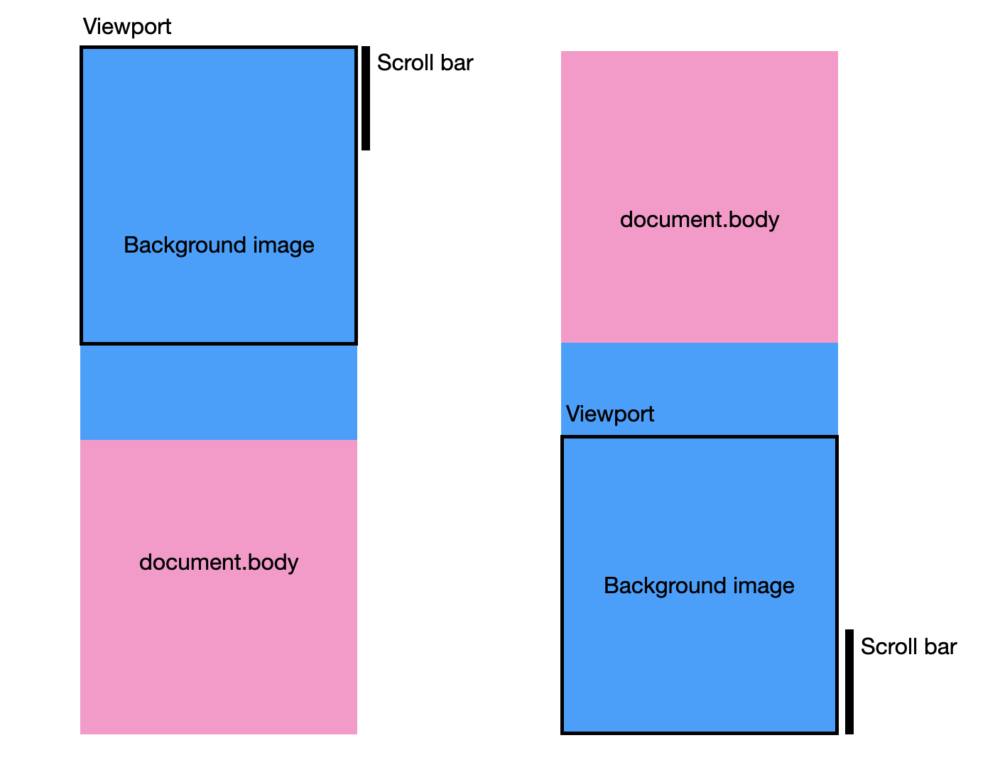

# React에서 Parallax Scroll 컴포넌트 만들기

Parallax Scroll은 실제 스크롤 속도와 다른 속도, 즉 시차를 두고 요소를 움직이게 하는 것이다.

배경 이미지를 스크롤보다 느리게 움직이도록 만들어야하는 요구사항이 있어 만들게 되었다.

먼저 결과물 부터 스포하자면, [이 유튜브 링크](https://youtu.be/mPXaqnyDKi4)를 타고 들어가면 확인할 수 있다. 스크롤이 내려가면서 배경 이미지도 천천히 위로 올라가는 것이 보일 것이다.

## 설계

컴포넌트 이름은 `<ParallaxBackground />` 라고 짓고, 아래와 같이 설계했다.

- 배경 이미지가 `window.innerHeight`, 즉 viewport height 대비 몇 배의 height를 가질 것인지의 비율 `ratio`를 prop으로 받는다. `ratio`는 당연히 1 이상이다.
- 배경 이미지의 height와 viewport height의 차를 구하고, 거기에 현재 스크롤이 얼마나 되었는지의 비율을 곱한 값을 사용해 배경 이미지를 Y축으로 translate한다.

이를 그림으로 표현하면 아래와 같다.



## 구현

시작은 배경 이미지를 삽입하는 것이었다. 모바일 제품이긴 하지만, 기본적으로 이미지를 배경 전체에 쓰는 것이기 때문에, 용량이 클 수 밖에 없다.

따라서 아래와 같이 lazy load하고, 로딩이 끝나면 opacity를 바꿔 fade in 되도록 구현했다.

```typescript
const image = document.createElement("img");
image.style.width = `${window.innerWidth}px`;
image.style.minHeight = `${window.innerHeight * ratio}px`;
image.style.opacity = "0";
image.style.transition = "opacity 0.2s";
image.onload = () => {
  requestAnimationFrame(() => {
    image.style.opacity = "1";
  });
};
```

그리고 아래와 같이 컨테이너를 만들고 위에서 만든 `img` 엘리먼트를 추가해줬다.

```tsx
<div>
  <div
    ref={containerRef}
    css={css`
      ${position("fixed", 0, 0, 0, 0)}
      z-index: 0;
    `}
  />
  <div
    css={css`
      ${position("relative")}
      z-index: 1;
    `}
  >
    {children}
  </div>
</div>
```

```typescript
const container = containerRef.current;
if (container == null) {
  return;
}

container.appendChild(image);
```

이제 배경 이미지를 translate하는 로직을 구현하면 끝난다. 필요한 값은 아래와 같다.

- 현재 스크롤이 얼마나 되었는지의 비율: `window.scrollY / document.body.scrollHeight`
- translateY 값: `(window.innerHeight * ratio - window.innerHeight) * (현재 스크롤이 얼마나 되었는지의 비율)`

```typescript
const vh = window.innerHeight;
const diff = vh * ratio - vh;
const handleScroll = () => {
  requestAnimationFrame(() => {
    const scrollTop = window.scrollY;
    const scrollHeight = document.body.scrollHeight;
    const scrolledRatio = scrollTop / scrollHeight;
    image.style.transform = `translateY(${diff * scrolledRatio * -1}px)`;
  });
};

window.addEventListener("scroll", handleScroll);
```

전체 코드는 아래와 같다.

```tsx
<ParallexBackground ratio={1.5} url={backgroundImageURL}>
  <h1>Page Title</h1>
  <p>Something...</p>
</ParallexBackground>
```

```tsx
export function ParallexBackground({ ratio, url, children }: { ratio: number; url: string; children: ReactNode }) {
  const parallaxContainerRef = useRef<HTMLDivElement>(null);

  useEffect(() => {
    const container = parallaxContainerRef.current;
    if (container == null) {
      return;
    }

    const vw = window.innerWidth;
    const vh = window.innerHeight;

    const image = document.createElement("img");
    image.style.opacity = "0";
    image.style.transition = "opacity 0.2s";
    image.style.width = `${vw}px`;
    image.style.minHeight = `${vh * ratio}px`;
    container.appendChild(image);

    image.src = url;
    image.onload = () => {
      requestAnimationFrame(() => {
        image.style.opacity = "1";
      });
    };

    const diff = vh * ratio - vh;
    const handleScroll = () => {
      requestAnimationFrame(() => {
        const scrollTop = window.scrollY;
        const scrollHeight = document.body.scrollHeight;
        const scrolledRatio = scrollTop / scrollHeight;
        image.style.transform = `translateY(${diff * scrolledRatio * -1}px)`;
      });
    };

    window.addEventListener("scroll", handleScroll);

    return () => {
      window.removeEventListener("scroll", handleScroll);
      container.removeChild(image);
    };
  }, [url, ratio]);

  return (
    <div>
      <div
        ref={parallaxContainerRef}
        css={css`
          ${position("fixed", 0, 0, 0, 0)}
          z-index: -1;
          overflow: hidden;
        `}
      />
      <div
        css={css`
          z-index: 1;
        `}
      >
        {children}
      </div>
    </div>
  );
}
```
