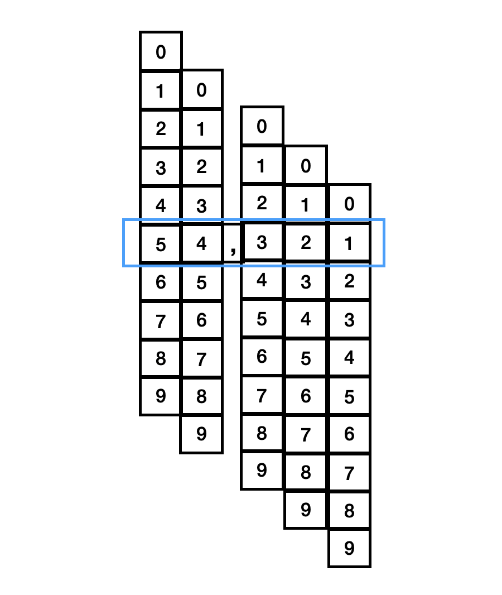

# React에서 숫자가 올라가고 내려가는 텍스트 애니메이션 컴포넌트 구현하기

주식 종목 가격이 바뀔 때, 바뀐 숫자가 올라가고 내려가는 텍스트 애니메이션을 필요로 했다. 실제 결과물은 [이 유튜브 링크](https://youtu.be/uxJIEwMhCb0)에서 확인할 수 있다.

## 설계

우선 컴포넌트 이름은 `<RollingNumber />`라고 정했고, 아래와 같이 children으로 string만 넘기는 아주 간단한 인터페이스로 사용할 수 있으면 좋겠다고 생각했다.

```tsx
<span>
  <RollingNumber>{amount.toLocaleString("en-US")}</RollingNumber>원
</span>
```

애니메이션을 어떻게 만들지도 아주 간단히 구상할 수 있었는데, children으로 넘어온 string 중 숫자 부분에만 0~9까지 세로로 렌더링한 후, 값이 바뀌면 Y축으로 translate 하는 것이다.

예를 들어, `54,321` 이라는 string은 아래 그림과 같이 렌더링되는 것이다.



## 구현

먼저 children으로 넘어온 string을 한 글자씩 나눠서, 숫자인 값만 필터링 해야한다. 숫자가 아니라면 그냥 인라인 텍스트로 렌더링했다.

```tsx
<span>
  {children.split("").map((child, index) => {
    return isNumber(child) ? (
      <RollingNumberItem key={index} initialAnimate={initialAnimate} value={parseInt(child)} />
    ) : (
      <span key={index}>{child}</span>
    );
  })}
</span>
```

그리고 숫자를 렌더링 했을 때의 CSS 픽셀 상의 width, height를 구해줘야 하는데, 그 이유는 아래와 같다.

- 0~9 간의 width는 서로 다르므로, 값이 바뀔 때마다 계산해야한다.
- Y축으로 translate 하기 위해 세로로 렌더링한 0~9 텍스트 엘리먼트끼리 같은 height를 가져야 한다.
- `<RollingNumber />`가 스스로 폰트에 대해 정할 수 없다. 그것을 감싸고 있는 부모의 폰트 설정에 따라 달라져야 한다.

따라서 아래와 같이 `opacity: 0`으로 숫자를 렌더링한 후 크기를 구해주었다.

```typescript
function useElementSize({ key }: { key: any }) {
  const ref = useRef<HTMLSpanElement>(null);
  const [size, setSize] = useState<{ width: number; height: number } | null>(null);

  useEffect(() => {
    const element = ref.current;
    if (element == null) {
      return;
    }

    setSize({ width: element.offsetWidth, height: element.offsetHeight });
  }, [key]);

  return { ref, size };
}
```

```tsx
const { ref, size } = useElementSize({ key: value });

if (size == null) {
  return (
    <span
      ref={ref}
      css={css`
        display: inline-flex;
        opacity: 0;
      `}
    >
      {value}
    </span>
  );
}
```

최초 1회 크기를 구한 이후 부터는 `position: absolute`로 보이지 않는 엘리먼트를 하나 렌더링 해두고, 변경된 숫자 텍스트의 크기를 계속 재계산 해준다.

```tsx
<span
  ref={ref}
  css={css`
    ${position("absolute", { top: 0, left: 0 })}
    display: inline-flex;
    opacity: 0;
  `}
>
  {value}
</span>
```

이제 0~9까지 세로로 렌더링하여 애니메이션을 적용해줄 차례이다. 애니메이션을 적용할 때 `transform` 대신 `animation`을 사용했는데, 그 이유는 `transform`을 사용하면 브라우저에서 첫 렌더링 직후에 애니메이션 적용이 되지 않는 렌더링 버그가 있었기 때문이다.

아래 코드에 명시된 keyframes는 prevValue -> currentValue 까지의 Y축 transform을 구현한다.

```tsx
const TRANSITION = {
  DURATION_MS: 600,
  TIMING_FUNCTION: bezierToCss(bezier.expo),
};

const numbers = [0, 1, 2, 3, 4, 5, 6, 7, 8, 9];

const [prevValue, setPrevValue] = useState(initial ? 0 : value);

useEffect(() => {
  return () => {
    setPrevValue(value);
  };
}, [value]);

const animationName = `rolling-number-initial-${prevValue}-${value}-${size.height}`;

return (
  <span
    css={css`
      display: inline-flex;
      flex-direction: column;
      text-align: center;

      @keyframes ${animationName} {
        from {
          transform: translate3d(0px, -${size.height * prevValue}px, 0px);
        }
        to {
          transform: translate3d(0px, -${size.height * value}px, 0px);
        }
      }

      animation: ${animationName};
      animation-duration: ${TRANSITION.DURATION_MS}ms;
      animation-timing-function: ${TRANSITION.TIMING_FUNCTION};
      animation-fill-mode: forwards;

      > * {
        will-change: width, height;
        width: ${size.width}px;
        height: ${size.height}px;
        flex-shrink: 0;
      }
    `}
  >
    {numbers.map((num) => (
      <span key={num}>{num}</span>
    ))}
  </span>
);
```

전체 코드는 아래와 같다.

```tsx
function isNumber(str: string) {
  return /^[0-9]$/.test(str);
}

export function RollingNumber({ initialAnimate, children }: { initialAnimate?: boolean; children: string }) {
  const isMounted = useIsMounted();

  if (!isMounted) {
    return null;
  }

  return (
    <span>
      {children.split("").map((child, index) => {
        return isNumber(child) ? (
          <RollingNumberItem key={index} initialAnimate={initialAnimate} value={parseInt(child)} />
        ) : (
          <span key={index}>{child}</span>
        );
      })}
    </span>
  );
}

const TRANSITION = {
  DURATION_MS: 600,
  TIMING_FUNCTION: bezierToCss(bezier.expo),
};

const numbers = [0, 1, 2, 3, 4, 5, 6, 7, 8, 9];

function RollingNumberItem({ initialAnimate, value }: { initialAnimate?: boolean; value: number }) {
  const { ref, size } = useElementSize({ key: value });

  if (size == null) {
    return (
      <span
        ref={ref}
        css={css`
          display: inline-flex;
          opacity: 0;
        `}
      >
        {value}
      </span>
    );
  }

  return (
    <span
      css={css`
        ${position("relative")}
        display: inline-flex;
        justify-content: center;
        will-change: width, height;
        width: ${size.width}px;
        height: ${size.height}px;
        overflow: hidden;
        will-change: width, height;
        transition: width ${TRANSITION.DURATION_MS}ms, height ${TRANSITION.DURATION_MS}ms;
        transition-timing-function: ${TRANSITION.TIMING_FUNCTION};
      `}
    >
      <span
        ref={ref}
        css={css`
          ${position("absolute", { top: 0, left: 0 })}
          display: inline-flex;
          opacity: 0;
        `}
      >
        {value}
      </span>
      <Animate initial={initialAnimate} value={value} size={size} />
    </span>
  );
}

function Animate({
  initial = true,
  value,
  size,
}: {
  initial?: boolean;
  value: number;
  size: { width: number; height: number };
}) {
  const [prevValue, setPrevValue] = useState(initial ? 0 : value);

  useEffect(() => {
    return () => {
      setPrevValue(value);
    };
  }, [value]);

  const animationName = `rolling-number-initial-${prevValue}-${value}-${size.height}`;

  return (
    <span
      css={css`
        display: inline-flex;
        flex-direction: column;
        text-align: center;

        @keyframes ${animationName} {
          from {
            transform: translate3d(0px, -${size.height * prevValue}px, 0px);
          }
          to {
            transform: translate3d(0px, -${size.height * value}px, 0px);
          }
        }

        animation: ${animationName};
        animation-duration: ${TRANSITION.DURATION_MS}ms;
        animation-timing-function: ${TRANSITION.TIMING_FUNCTION};
        animation-fill-mode: forwards;

        > * {
          will-change: width, height;
          width: ${size.width}px;
          height: ${size.height}px;
          flex-shrink: 0;
        }
      `}
    >
      {numbers.map((num) => (
        <span key={num}>{num}</span>
      ))}
    </span>
  );
}

function useElementSize({ key }: { key: any }) {
  const ref = useRef<HTMLSpanElement>(null);
  const [size, setSize] = useState<{ width: number; height: number } | null>(null);

  useEffect(() => {
    const element = ref.current;
    if (element == null) {
      return;
    }

    setSize({ width: element.offsetWidth, height: element.offsetHeight });
  }, [key]);

  return { ref, size };
}
```
