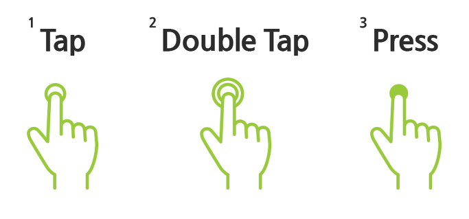
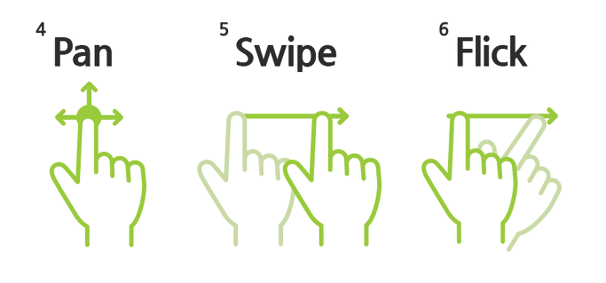
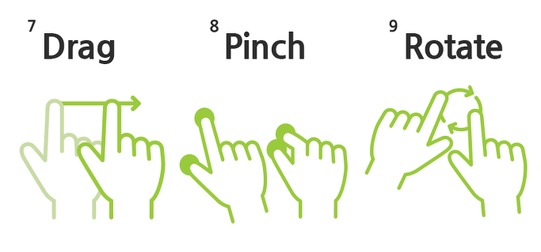

# 터치 제스처 용어 정리

1. Tap

- 스크린에 손가락을 댔다가 빠르게 떼는 것.

2. Double Tap

- Tap 동작을 빠르게 두 번 하는 것.

3. Press

- 손가락을 댄 후 일정 시간동안 떼지 않고 유지하는 것.

4. Pan

- 손가락을 떼지 않고 방향 제한 없이 계속 드래그하는 것.

5. Swipe

- 손가락을 대고 일직선으로 드래그하는 것.

6. Flick

- Swipe 동작을 더 빠르게 하는 것.

7. Drag

- 오브젝트를 이동시키거나, 정해진 방향으로 움직인 후 손을 떼는 것. Pan, Swipe와 유사하지만 화면 내 특정 오브젝트를 대상으로 한다는 점에서 Pan과 차이가 있고, 방향 제한이 없다는 점에서 Swipe와 차이가 있다.

8. Pinch (in/out)

- 손가락 두 개를 대고 두 손가락 사이 간격을 넓히거나 좁히는 것.

9. Rotate

- Pinch처럼 두 손가락을 이용하여 원을 그려 오브젝트를 회전시키는 것.
