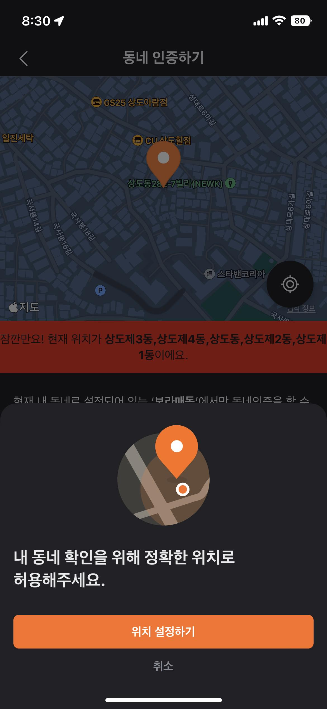

# 위치 권한: 정확한 위치

iOS에서 앱에 위치 권한을 부여할 때, `정확한 위치`라는 옵션을 토글 가능하다.

이 옵션이 꺼져있는 경우, 앱에는 어느 정도 오차가 있는 대략적인 범위만 제공된다.

안드로이드에도 같은 기능을 하는 옵션이 존재한다.

TMI: 당근마켓의 동네인증 같은 기능처럼 유저의 위치를 최대한 정확하게 파악하는 것이 중요한 경우, 앱단에서 아래처럼 처리하고 있었다.

